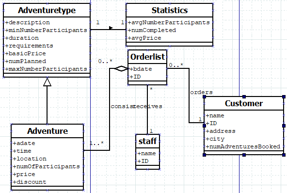
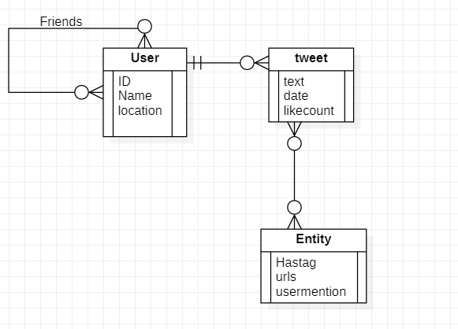
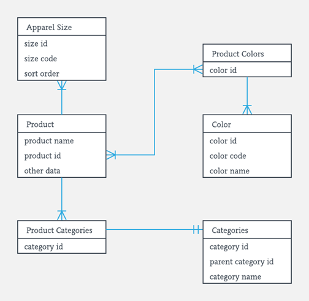

# MongoDB Task 2
## 1. "Adventure Database" data model analysis
> Use the “Adventure database“ data model from Moodle and create a schema for a
MongoDB. Justify your design.



### Solution
Two documents called Order & Adventure

#### Adventure
Includes following tables:
- AdventureType
- Statistics
```json
{
    "name":"Mountenbiking",
    "Adventuretype":{
        "description":"Beginner Trailtraining in Schladming",
        "minNumberParticipants":2,
        "duration":"2days",
        "reqirements":"basic cycling skills",
        "basicPrice":99.99,
        "maxNumberParticipants":10
    },
    "Statistics":{
        "avgNumberParticipants":5,
        "numCompleted":10,
        "avgPrice":110.94
    }
}
```


#### Order
Includes following tables:
- OrderList
- Staff
- Customer
- Adventure
```json
{
    "ID":12343242,
    "date":"20-01-2024",
    "staff":{
        "name":"James Bond",
        "ID":7
    },
    "customer":{
        "name":"Joe Doe",
        "ID":47,
        "Address":"Fischergasse 4 4600 Wels",
        "numAdventuresBooked":2
    },
    "adventures":[{
        "name":"Mountenbiking",
        "date":"20-06-2024",
        "time":"08:30",
        "location":"Schladming",
        "price":100,
        "discount":0
    },{
        "name":"Trail Hiking",
        "date":"20-06-2024",
        "time":"04:30",
        "location":"Schladming",
        "price":10,
        "discount":20
    }]
}
```
#### Justification
- Two diffrent docuemnts because it makes little sense to save the same statistic in every file
- Same with the adventuretype
- for each Order a document is generated, it includes:
  - what adventure have been ordered
  - who orderd (user)
  - and what staff is responsible 
- A order can include more than one adventure so it is a array in the document
- each time a new order gets added, the statistics have to be updated to keep the db consitent 


## 2. Twitter Data Model
> Take the test data from Twitter of the last exercise and analyze the schema. Describe the
schema in your transcript. Change the NoSQL schema into a relation model and justify and
describe your decision.

### Solution
Download and unzip twitter.zip. Reveals a .bson file. Include data with following command:

```bash
mongorestore mongodb://localhost:27017 -d Testbase -c twitter tweets.bson
```
To analyze we convert to json 
```json
{
  "_id": "4fb9fb91d066d657de8d6f36",
  "text": "eu preciso de terminar de fazer a minha tabela, está muito foda **",
  "in_reply_to_status_id": null,
  "retweet_count": null,
  "contributors": null,
  "created_at": "Thu Sep 02 18:11:23 +0000 2010",
  "geo": null,
  "source": "web",
  "coordinates": null,
  "in_reply_to_screen_name": null,
  "truncated": false,
  "entities": {
    "user_mentions": [],
    "urls": [],
    "hashtags": []
  },
  "retweeted": false,
  "place": null,
  "user": {
    "friends_count": 73,
    "profile_sidebar_fill_color": "768575",
    "location": "",
    "verified": false,
    "follow_request_sent": null,
    "favourites_count": 1,
    "profile_sidebar_border_color": "1c9dbd",
    "profile_image_url": "http://a2.twimg.com/profile_images/1036412454/OgAAADXK9q6kaxrvfwQTINH66RVLAH9YHb-veRTA4FaWb9KtbGGV_yKTGzmvzTfJidqAb5gK_mpspIE-MIvAASGH2CwAm1T1UIPQk0-HS8x_TV5kdnW30nch7ODk-1_normal.jpg",
    "geo_enabled": false,
    "created_at": "Fri Jul 03 21:44:05 +0000 2009",
    "description": "só os loucos sabem (:",
    "time_zone": "Brasilia",
    "url": "http://http://www.orkut.com.br/Main#Profile?uid=1433295880233078770",
    "screen_name": "Bia_cunha1",
    "notifications": null,
    "profile_background_color": "081114",
    "listed_count": 0,
    "lang": "en",
    "profile_background_image_url": "http://a1.twimg.com/profile_background_images/133178546/biatwitter.jpg",
    "statuses_count": 3504,
    "following": null,
    "profile_text_color": "25b8c2",
    "protected": false,
    "show_all_inline_media": false,
    "profile_background_tile": true,
    "name": "Beatriz Helena Cunha",
    "contributors_enabled": false,
    "profile_link_color": "eb55b6",
    "followers_count": 102,
    "id": 53507833,
    "profile_use_background_image": true,
    "utc_offset": -10800
  },
  "favorited": false,
  "in_reply_to_user_id": null,
  "id": {
    "$numberLong": "22819396900"
  }
}
```
Most important aspekts of this documents
- Each Tweet contains a User (the author)
- Together with the text, geo, time, source and id is saved
- A Tweet can be completly recreated with one json
- But if a User changes his profile picture it has to be changed in every tweet
- usermentions, urls & hashtags get saved in an extra object 
- datetime is used an not epochtime
- colors a saved in hex
- pictures are saved on a diffrent server only a link is saved in the json (probably a intern media server)

#### Relation Model
To keep it readable just a few representive params will be used 



> The biggest improvemnt by far is the seperation of the user with the tweet!

- Each user is saved in a singel table, this improves the consitentsy 
- Friends are saved as a Many-To-Many relation (self-reference)
- Each tweet has a single author, but a single user can write many tweets -> One-To-Many
- A tweet can have more than one hastag and a hastag can be used on more than one tweet -> Many-To-Many
- All other paramas can be added as colums to these three tables

## 3. Own data model
> Take an RDBM of your choice with at least 5 entity types (from one of the last exercises in
INSY 3rd/4th class e.g. „Fertigung, Hardwarehersteller etc.“) and convert the schema into a
NoSQL schema for MongoDB. Justify and describe your design

### Solution
> No access to "Moodle 4.Klasse" and no saved files! Instead using a ER-Diagramm from the net.



Url: https://www.guru99.com/er-diagram-tutorial-dbms.html


#### possible nosql design: 
```json
{
  "productName":"RotesLaiberl",
  "productID":1,
  "sizeCode":"XXL",
  "sortOrder":"reverse",
  "colors":
  [{
    "id":1,
    "code":"#5b2a01",
    "name":"red"
  },{
    "id":2,
    "code":"#ffffff",
    "name":"white"
  }
  
  ],
  "categories":[
    {"id":1,
    "name":"T-Shirt"},
  {"id":2,
  "name":"Clothing"}
  ]
}
```
#### justification and explanation 
- i assume the table product was the most important 
  - nosql schema is called product
  - first attribute is name of the product
- for each diffrent size a new document has to be added 
- one product can have multiple colors
  - using a array of color object 
  - each object has a id, colorname & hex presentation
- a product can be part of multiple categories 
  - same solution as colors: object array 
